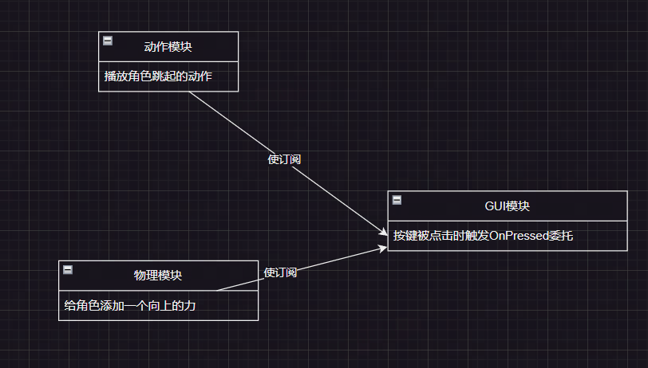

游戏开发中常用**事件模式**的设计思路；以Unity为例，**借助C#的特性可以轻松地实现事件系统**。


## **delegate 委托** 

通俗地说，委托就是一个**占坑用的方法**，这个方法会在开发者指定的时刻被调用，至于方法的内容是什么，就看代码逻辑中给委托里订阅了什么内容了。

举例来说，现在有一个按钮，它有一个委托“OnPressed”，在用户按下去的时候会执行这个委托；具体会发生什么呢？这就看游戏中的其他模块往这个委托中添加了什么方法了。

这么做可以大大提升程序的**灵活性、可重用性，也将不同模块的耦合度降低了**，




delegate 是C#中的一个关键字，用于标记这条语句正在声明一个委托类型，这一点与关键字enum类似。

```c#
public delegate void Callback(string message);
```

上示的代码声明了一个名为Callback的**委托类型**，注意这里**同时声明了返回类型void和方法的参数**。下文将以Callback类为例展开说明。

Callback类的对象是**“方法”**，Callback类的对象需要**如上面所声明**的、以void为返回类型，并且必须仅接受一个string对象作为参数；如果返回类型或参数不匹配，编译器会报错。

可以通过下面的语句来**实例化Callback类的对象**：

```c#
static void Main(string[] args)
{   
    // 直接创建委托实例
    Callback callback0 = new Callback(PrintMessage);
    // 使用方法组进行隐式类型转换
    Callback callback1 = PrintMessage;
    // 使用lambda表达式
    Callback callback2 = (string message) => Console.WriteLine(message);
    // 使用匿名方法
    Callback callback3 = delegate(string message) { Console.WriteLine(message); };
}

static void PrintMessage(string message) => Console.WriteLine(message);
```


**Callback类的对象可以像方法一样使用：**

```c#
Callback callback = (string message) => Console.WriteLine(message);

callback("Hello, World!");
callback?.Invoke("Hello, World!");

// output:
// Hello, World!
// Hello, World!
```


**Callback类的对象可以承载多个方法**，这些方法将按照添加顺序依次执行，这个特性被称为“多播”。

```c#
static void Main(string[] args)
{   
    Callback callback = (string message) => Console.WriteLine(message);
    Callback toUpper = (string message) => Console.WriteLine(message.ToUpper());
    // 订阅其他方法
    callback += toUpper;
    callback += PrintMessageToLower;

    callback?.Invoke("Hello World");
    // Output:
    // Hello World
    // HELLO WORLD
    // hello world

    Console.WriteLine("====================================");

    // 取消订阅方法
    callback -= toUpper;
    callback -= PrintMessageToLower;

    callback?.Invoke("Hello World");
    // Output:
    // Hello World
}

static void PrintMessageToLower(string message) => Console.WriteLine(message.ToLower());
```

需要注意，**如果重复向一个委托中加入相同的方法，那么这个方法也会被执行多次：**

```c#
static void Main(string[] args)
{   
    Callback callback = PrintMessage;
    callback += PrintMessage;

    callback("Hello World!");   
    // Output:
    // Hello World!
    // Hello World!
}

static void PrintMessage(string message) => Console.WriteLine(message);
```

另外，**匿名方法是不能直接通过lambda表达式取消订阅的**，这是因为lambda表达式实际上是新创建了一个委托的实例，即使委托的内容完全一致，它们也不是一样的委托，因此无法被正常地取消订阅：

```c#
MyDelegate del = delegate { Console.WriteLine("Anonymous Method"); };
del += delegate { Console.WriteLine("Anonymous Method"); };
del -= delegate { Console.WriteLine("Anonymous Method"); }; // 无效
```


### 带有返回值的委托

委托类型也可以在声明时指定返回类型：

```c#
public delegate string Callback(string message);
static void Main(string[] args)
{   
    Callback callback = (string message) => message.ToUpper();
    Console.WriteLine(callback("Hello World!"));
    // Output: HELLO WORLD!
}
```

但是涉及多播时，情况会有点特殊，多播委托调用时会依次执行所有订阅的方法，但只有最后一个方法的返回值会被保留并作为多播委托的返回值。

```c#
public delegate string Callback(string message);
static void Main(string[] args)
{   
    Callback callback = (string message) => message.ToUpper();
    callback += (string message) => message.ToLower();
    Console.WriteLine(callback("Hello World!"));
    // Output: hello world!
}

static void PrintMessage(string message) => Console.WriteLine(message);
```


### Action和Func

如果开发者要为每个命名空间内的每种返回类型和参数列表的组合都声明一种委托类型的话，实在是太麻烦了。

**为了简化委托类型的声明流程，C#提供了两个内置的委托类型模板类，`Action<>`和`Func<>`。**

Action用于表示一个不返回值的委托，它可以有最多四个参数，如Action\<int>表示一个带有一个整数参数的委托，而Action<int, float, string, bool>表示一个带有四个参数的方法，分别为整数、浮点数、字符串和布尔值。

Func类与Action类相似，它表示带有返回值的方法，并且在声明时需要指定返回值类型。例如，Func\<int>表示一个返回整数类型的方法，而Func<int, float, string, bool>表示一个带有三个参数并返回布尔值类型的方法。

```c#
static void Main(string[] args)
{   
    Action<string> action = PrintMessage;
    Func<string, string> func = (string message) => message.ToUpper();

    action("Hello World");
    Console.WriteLine(func("Hello World"));
    // Output:
    // Hello World
    // HELLO WORLD
}

static void PrintMessage(string message) => Console.WriteLine(message);
```

使用Action和Func模版类来定义自己的委托，可以**精简声明的流程**，也增强了委托在不同模块之间的通用性，因为使用delegate关键字声明的不同委托类型之间即使返回类型和参数列表完全一致，也无法直接类型转换。


## event 事件

**event是一种特殊的委托，它与普通委托的核心区别在于它只能在声明它的类内调用。**

如果我们在另一个类中试图触发event，编译器会报出错误：

 

在声明一个event时，相较于声明普通的委托对象，我们只需要在声明语句中加入关键字`event`即可：

```c#
// 声明委托类型
public delegate void Callback(string message);
// 声明委托对象
public Callback OnCallback_Delegate;
// 声明事件对象
public event Callback OnCallback_Event;
```

event相较于delegate具有更好的封装性和安全性，但相对地也失去了一些灵活性。如果确定委托只应该在类内被触发，就把它标记为event吧。
