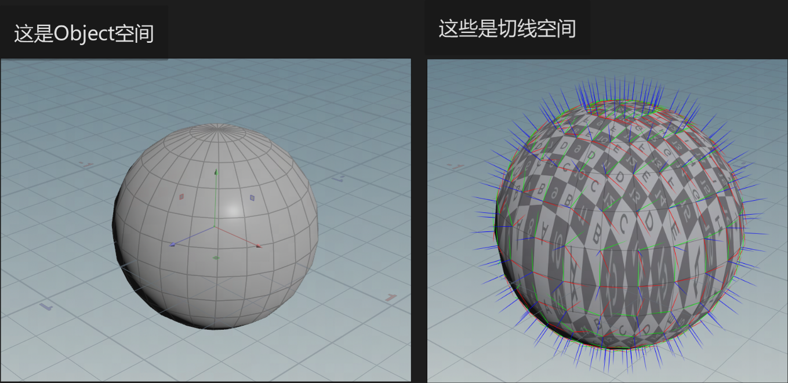
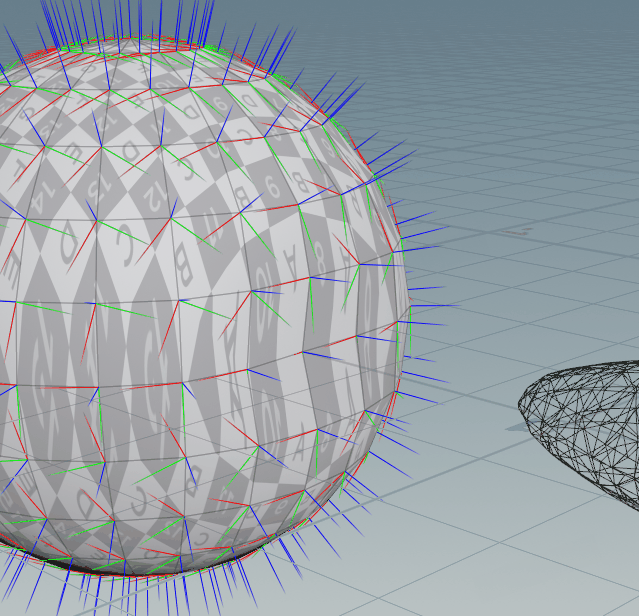
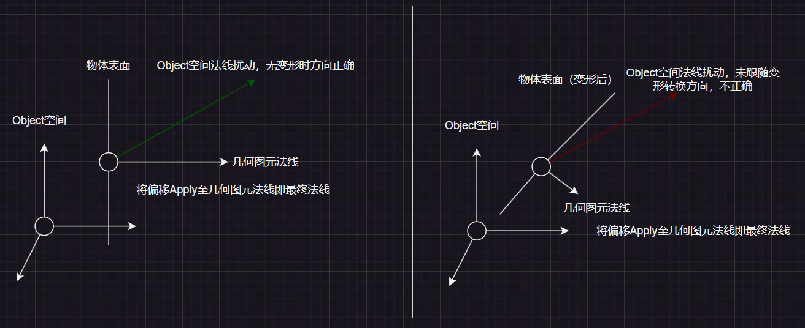
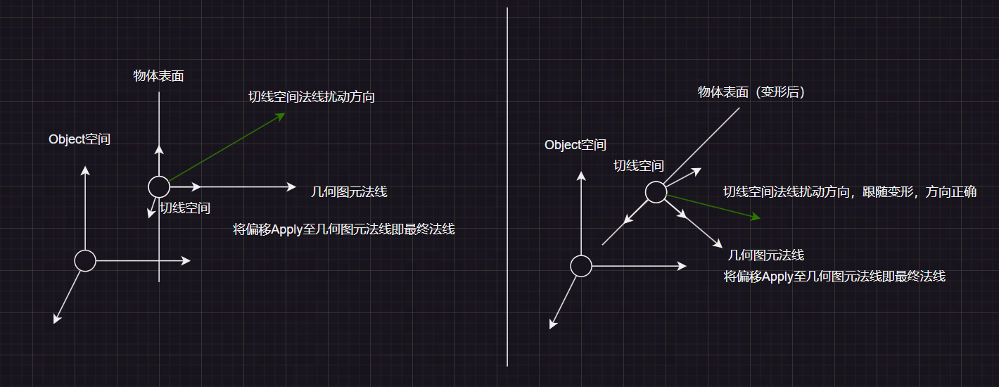

 

Object空间是每个Mesh独有的、在建模阶段就已经确定的空间；Vertex的顶点位置、法线方向等信息都记录在Object空间中。

切线空间是每个Vertex独有的、由Vertex的切线、副切线和法线分别作为XYZ坐标轴、以Vertex在Object空间下的位置作为Pivot组成的空间。切线空间会跟随Mesh的变形（Skinned Mesh等）而改变，这是因为Mesh变形时，Vertex的法线、切线和副切线也会随之变换。


## 切线的确定方式

模型文件导入Unity后会生成Mesh资产，Vertex的法线直接从模型文件中读取，而切线会根据Vertex的UV重新计算。

在Unity Mesh中，Vertex的切线方向是一个与其法线垂直的、指向uv中U维增大方向的向量。

下面这张GIF中，蓝线代表Vertex的法线，黄线代表Vertex的切线。可以观察到，当UV开始旋转时，Vertex的切线方向也随之旋转，它始终指向UV中U维增大的方向。

 


## 副切线的确定方式

副切线是同时垂直于法线和切线的向量，存在两个这样的方向。

参考[这篇文章](https://zhuanlan.zhihu.com/p/103546030)可以得知：副切线的选择由切线向量的w维（建模时确定）及RendererTransform的Scale同时确定。

```glsl
fixed tangentSign = v.tangent.w * unity_WorldTransformParams.w;
fixed3 worldBinormal = cross(worldNormal, worldTangent) * tangentSign;
```


## 切线空间的变换矩阵

从Mesh中可以获取Vertex在Object空间中的位置、切线、副切线和法线的方向，可以来构建TangentToObject矩阵了。

根据我们学过的线性代数知识，要构建一个LocalToWorld的变换矩阵，需要将4X4矩阵的第一列设置为X轴的方向向量、第二列设置为Y轴的方向向量、第三列设置为Z轴的方向向量、第四列设置为Translate、矩阵的第四行设置为（0,0,0,1）。

TangentToObject变换是一种LocalToWorld变换，因此它们的步骤也是一致的。在Unity中，我们约定切线空间的X轴为切线方向（右），Y轴方向为副切线方向（上）， Z轴方向为法线方向（前），可以用下面的代码来构建TangentToObject矩阵：

```c#
// Mesh中没有直接储存副切线向量，需要做一步计算：
Vector3 OSBitangent = OSTangent.w * Vector3.Cross(OSNormal, OSTangent);
// 构建objectToTangent矩阵
var tangentToObject = new Matrix4x4();
tangentToObject.SetColumn(0, new Vector4(OSTangent.x, OSTangent.y, OSTangent.z, 0.0f));
tangentToObject.SetColumn(1, new Vector4(OSBitangent.x, OSBitangent.y, OSBitangent.z, 0.0f));
tangentToObject.SetColumn(2, new Vector4(OSNormal.x, OSNormal.y, OSNormal.z, 0.0f));
tangentToObject.SetColumn(3, new Vector4(OSPosition.x, OSPosition.y, OSPosition.z, 1.0f));
var objectToTangent = Matrix4x4.Inverse(tangentToObject);
```

※：使用Mesh.GetNormals()等方法获取到的Mesh的法线、切线和副切线方向是已经经过归一化的，不需要额外处理。另外，在ShaderGraph中直接通过Normal Vector等节点获取到的法线、切线和副切线方向也是经过归一化的，也不需要再额外处理。


## 切线空间的应用思路

切线空间的应用思路一般是：将Object空间信息在制作阶段转为Tangent空间信息（特殊的位置、方向等），保存到Vertex的数据位或者贴图中；在Shader中，将读取到的Tangent空间信息重新转回Object空间使用。

你可能会好奇，为什么要这么倒腾一下呢？这是因为切线空间有一个重要的非常好的性质，那就是在文章开头提到过的：切线空间会跟随Mesh的变形发生改变（这是因为Vertex的法线和切线都会随着Mesh的变形发生改变），因此当Shader把切线空间中的特殊数据转回Object空间时，这份特殊数据也会接受到Mesh的变形。

从下面的GIF中，我们可以清晰地观察到切线空间的变化：

 

切线空间最广泛的应用是法线贴图，一般来说法线贴图中储存的就是切线空间中对法线方向的<u>扰动</u>。

我们来通过一个例子来看下如果将法线方向扰动储存在Object空间中会导致什么样的结果：

 

如果按照常规将法线偏移信息储存在切线空间中，变形后的物体法线方向正确：



※：这也能引申出法线贴图总是呈现蓝紫色的原因，物体的表面大部分区域扰动并不强烈，即“扰动方向和几何图元法线的夹角很小”，表现在偏移方向向量上就是：（x方向-切线方向-小值，y方向-副切线方向-小值，z方向-几何图元法线方向-大值），几乎（0,0,1）的状态；又因为单位向量每维度的取值范围是-1~1，因此需要做一步`remap(-1,1,0,1,x);`，就变成了（0.5,0.5,1），将其转换为颜色就是法线贴图中常见的蓝紫色。

