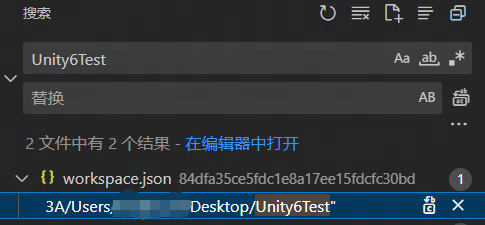

VSCode以一个文件夹为Root创建工作区，也就是WorkSpace。

比如一个Unity项目，用VSCode打开时，就会以Unity项目文件夹为Root创建一个工作区。

有时候一个工作区内需要好几个版本管理区域，我们就会在VSCode中打开好多个版本管理库。任务完成后，我们可能会在VSCode中关闭这个储存库，或者直接删掉这个储存库。

VSCode中有一个常用命令，叫做`Git：重新打开已关闭的储存库`，它可以方便我们灵活地开启和切换到其他在工作中的库。然而，这个命令的列表会记录所有曾经在工作区中打开过的库，不管这个库实际上是否仍然存在。

日积月累下来列表会变得冗余难用，但是VSCode并没有提供方法去管理这个列表。

在网上搜了一圈后，我得到这样一个方法可以清理掉这个已关闭的储存库的列表：

首先找到这个路径：

`C:\Users\YourUserName\AppData\Roaming\Code\User\workspaceStorage`

里面应该有一堆以哈希值命名的文件夹。

在workspaceStorage这个文件夹中右键，用VSCode打开，然后通过侧边栏中的全局搜索功能去搜你的工作区名字：

 

找到这个文件所处的文件夹，直接删掉整个文件夹。

这样做其实是删掉了工作区的一些长久储存的数据，包括打开过的Git储存库的列表。

这可能会误伤到其他工作区设置，不过应该影响不是很大，只是一些IDE的配置而已。

