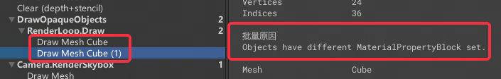

Material Property Block（材质属性块）是Unity中的一个**数据结构**，用于在渲染过程中**向材质实例提供额外的属性数据**。它可以包含**一组键值对**，每个键值对对应于材质实例中的一个**属性**。在渲染时，可以**将多个对象的MPB实例传递给渲染器**，以**避免为每个对象创建新的材质数据副本**，从而提高渲染性能。同时，使用MPB还可以**更容易地实现材质属性的动态变化，因为它可以在渲染过程中动态修改材质属性**。 


## 用法

和Material类似地、可以直接使用**Block对象的SetFloat等**方法。

Block对象可以直接**从Renderer组件里获取，改完后再塞回去**。

```c#
private void OnValidate() {
        var renderer = GetComponent<Renderer>();
        var material = renderer.sharedMaterial;
        var block = new MaterialPropertyBlock();
        renderer.GetPropertyBlock(block);
        block.SetColor("_Color",color);
        renderer.SetPropertyBlock(block);
}
```

当使用上述的方法给Renderer Set过属性后，对应的属性将**无法再通过材质面板被直接修改**。这样的修改在**运行时是持续性的**，即只需要Set一次，这个值将在下次修改block之前都保持在你Set的值。因此只**在确认需要更新属性的时候SetBlock即可**，这个Get和SetBlock的操作是**有一定性能开销**的。

如果想要恢复参数为材质上本身的，可以对Renderer使用：`Renderer.SetPropertyBlock(null);`


Material Property Block在**GPUInstance**中也有非常广泛的应用。


## 优缺点

**优点**

可以**避免生成很多材质实例**，材质实例还是太多了还是蛮占内存的，尤其是属性比较多的材质。

[关于材质示例](https://zhuanlan.zhihu.com/p/603748892)

**缺点**

经过验证、不同的MPB会**导致合批被打断**。


