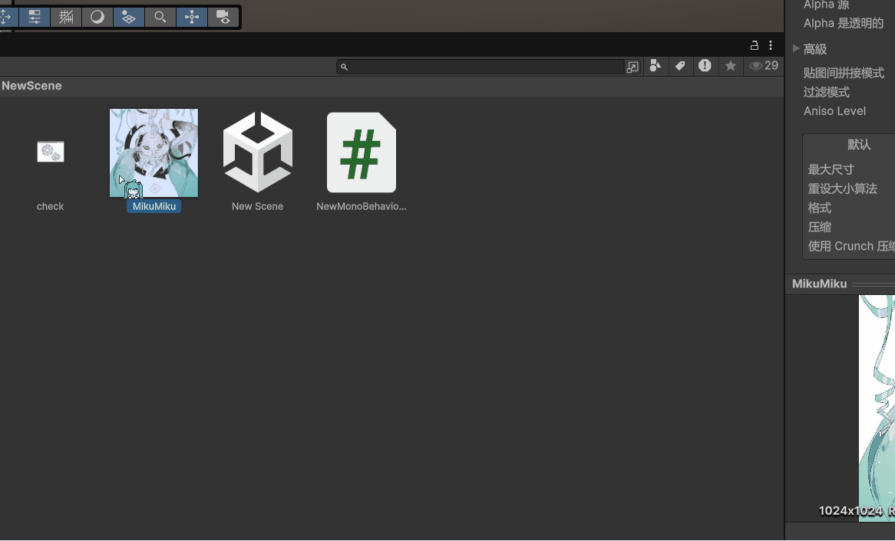
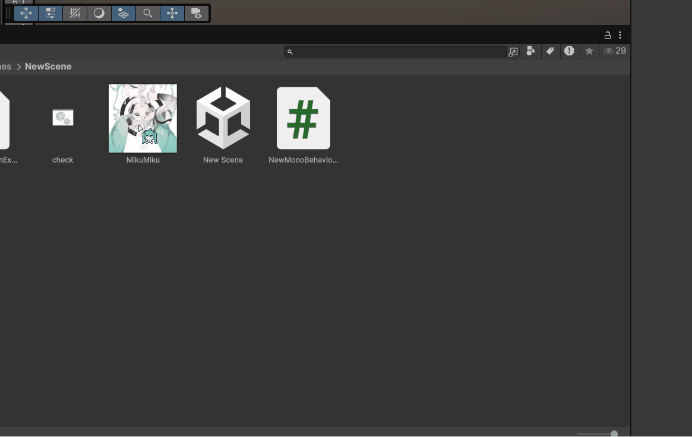
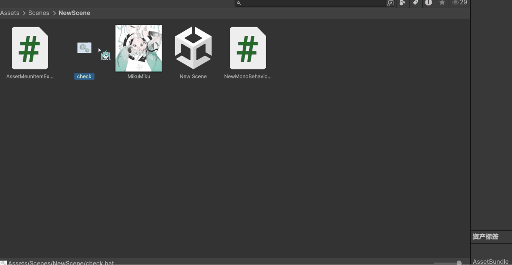

如果能在Unity中直接使用一些外部工具有时会非常方便。


## 直接在Unity中执行Tortoise指令

有时想看一个文件或文件夹的Git Log，我们需要先在Unity中右键单击文件，再在文件夹中找到这个文件，然后再右键单击文件，才能打开Git Log。如果能在Unity中右键选中文件后直接打开GitLog会方便很多。

我们可以在Unity的MenuItem的Assets菜单中添加一项来做到这件事情：

```c#
// 默认TortoiseGit会加入环境变量，所以这里直接用exe的名字就可以了
private const string TORTOISEGITPATH = "TortoiseGitProc.exe";

// 在Assets Menu Item中加入Git Log
[MenuItem("Assets/Git Log", false, 2000)]
private static void OpenWithTortoiseGitLog() =>
    TortoiseCommand(TORTOISEGITPATH, "log");
//  这是上面这个菜单项的验证函数，用于判断这个资产是否应该显示这个菜单项
[MenuItem("Assets/Git Log", true)]
private static bool ValidateOpenWithTortoiseGitLog() => 
    Selection.activeObject != null;

private static void TortoiseCommand(string tortoisePath, string command)
{
    if (!GetAssetPath(out string fullPath)) return;

    string arguments = $"/command:{command} /path:\"{fullPath}\"";

    // 通过C#的Process类来执行新的程序
    Process.Start(new ProcessStartInfo
    {
        FileName = tortoisePath,
        Arguments = arguments,
        UseShellExecute = false,
        CreateNoWindow = true
    });
}

private static bool GetAssetPath(out string targetFullPath)
{
    targetFullPath = AssetDatabase.GetAssetPath(Selection.activeObject);
    targetFullPath = Path.GetFullPath(targetFullPath);
    var isValid = !string.IsNullOrEmpty(targetFullPath);
    if (!isValid)
        UnityEngine.Debug.LogError("No asset selected or path is invalid.");
    return isValid;
}
```

 


## 直接在Unity中使用Python脚本

Python有一些好用的库，如果能在Unity中直接执行Python脚本处理指定的对象，我们就不用自己从头开始实现一些功能了。

比如我们希望加一个菜单项，上下翻转一张纹理，可以这样做：

```c#
private static readonly string PYIMAGETOOLPATH = Path.GetFullPath("Assets/Tools/Python/ImageTools.py");

[MenuItem("Assets/上下翻转图片", false, 2000)]
private static void FlipImage()
    => PyImageTool(PYIMAGETOOLPATH, "flipUpAndDown");
[MenuItem("Assets/上下翻转图片", true)]
private static bool ValidateFlipImage() =>
    Selection.activeObject != null && Selection.activeObject is Texture2D;

private static void PyImageTool(string pyScriptPath, string command)
{
    if (!GetAssetPath(out string targetFullPath)) return;

    string arguments = $"\"{pyScriptPath}\" \"{targetFullPath}\" \"{command}\"";
    var process = Process.Start(new ProcessStartInfo
    {
        FileName = "python.exe",
        Arguments = arguments,
        UseShellExecute = false,
        RedirectStandardError = true // 重定向程序的输出流，如果程序出错，我们可以在Unity中得到Log
    });
    process.WaitForExit();
    var error = process.StandardError.ReadToEnd();
    if (string.IsNullOrEmpty(error))
        UnityEngine.Debug.Log("操作成功");
    else
        UnityEngine.Debug.LogError($"操作失败: {error}");

    AssetDatabase.Refresh();
}
```


在py文件中，我们可以通过sys.argv获取到C#中输入的参数：

```python
import sys
import PIL.Image as Image

def main():
    image_path = sys.argv[1]
    option = sys.argv[2]

    if option == "flipUpAndDown":
        flipUpAndDown(image_path)
        print("Image flipped up and down")


def flipUpAndDown(image_path : str):
    image = Image.open(image_path)
    image = image.transpose(Image.FLIP_TOP_BOTTOM)
    extension = image_path.split(".")[-1]
    new_file_path = image_path.replace(f".{extension}", f"_flipped_updown.{extension}")
    image.save(new_file_path)

if __name__ == "__main__":
    main()
```


可以得到这样的效果：


## 直接在Unity中执行bat脚本

有时我们会需要在Unity中执行一些bat脚本，用于做资产的检查等操作。

但是Unity中无法直接执行bat脚本，因此也需要我们去做一步改造：

```c#
[MenuItem("Assets/Run Bat", false, 2000)]
private static void RunBat()
{
    if (!GetAssetPath(out string fullPath)) return;
    var process = Process.Start(new ProcessStartInfo
    {
        FileName = "cmd.exe",
        Arguments = $"/c \"{fullPath}\"",
        WorkingDirectory = Path.GetDirectoryName(fullPath),
        UseShellExecute = false,
        CreateNoWindow = true,
        RedirectStandardError = true
    });
    UnityEngine.Debug.Log(process.StandardError.ReadToEnd());
    AssetDatabase.Refresh();
}
[MenuItem("Assets/Run Bat", true)]
private static bool ValidateRunBat() =>
    Selection.activeObject != null && Selection.activeObject is DefaultAsset;
```

上面Arguments中的/c指的是执行完后关掉cmd窗口，相对的还有/k。

- `/c`：执行指定的命令并在完成后终止。
- `/k`：执行指定的命令但在完成后不终止命令提示符窗口。

可以做到这样的效果：



