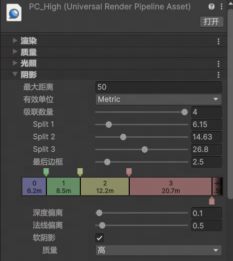
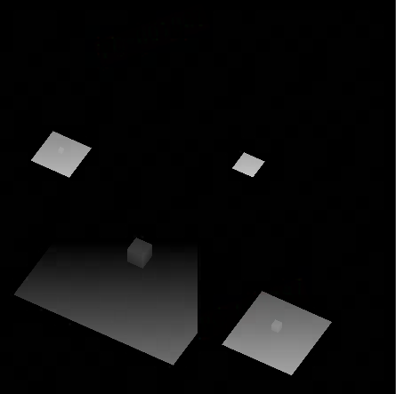
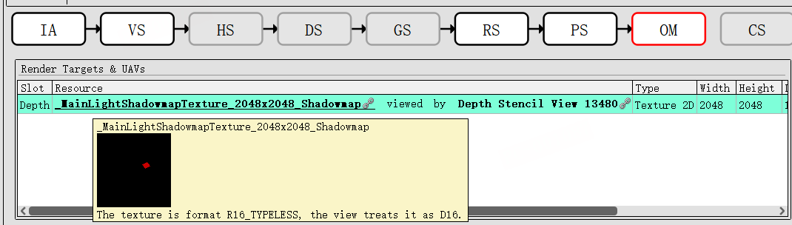
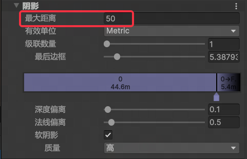
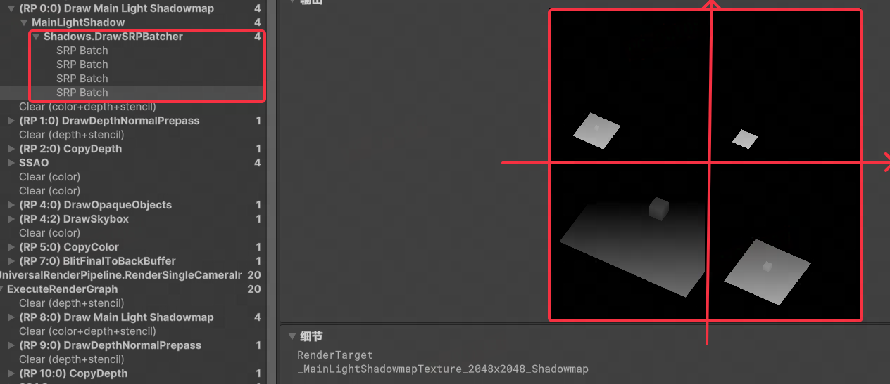

Unity URP中的阴影方案是**“SSSM（Screen Space Shadow Mapping，屏幕空间阴影映射）”**，本文将对Unity中的默认阴影方案做简单的解读。


## 光源

有光源才能投出阴影，光源上也有一些阴影相关的配置。

.png) 

以**主平行光**为例，通过FrameDebuger观察到调整其阴影配置时传入GPU的`_MainLightShadowParams`发生变化。

.png)


从URPLitShader中观察到`_MainLightShadowParams`控制了这些表现：

```glsl
float4      _MainLightShadowParams;   // (x: shadowStrength, y: >= 1.0 if soft shadows, 0.0 otherwise, z: main light fade scale, w: main light fade bias)
```


## 级联阴影

在Unity的渲染管线资产中，可以配置主光源的级联阴影参数。

 

级联阴影是以牺牲远处阴影质量为代价、提升近处阴影质量的一种技术。


级联数量为4意味着ShadowMap将被**等分为4个象限**，彩色的条带代表了**最大距离内四个象限如何分配阴影图的空间**。

如紫色块0上的信息，意味着距离相机0\~6.2米的渲染点将会使用第0象限的阴影图，第0象限储存了6.2米内的场景的深度信息，绿色块1则意味着相机6.2\~14.6米的渲染点将使用第1象限的阴影图，第1象限储存了8.5米的有效信息。下图为4级联的示意阴影图：

 

级联阴影的做法有点类似于图像的伽马编码，将更多的精度用于存储人眼比较敏感的暗部信息。


## Shadow Map的生成

物体被渲染时，会**比较灯光坐标系下渲染点深度和ShadowMap中记录的最小深度**，如果渲染点的深度大于最小深度，说明渲染点处于阴影中；如果使用了PCSS等滤波软阴影方案，则会多次采样ShadowMap，得到一个0~1的值用于描述渲染点被阴影遮蔽的程度。最终，**用Shadow值去影响输出颜色**，就让一个物体接受了阴影。


那么这张ShadowMap是如何生成的呢？

以主平行光为例，可以从FrameDebuger中观察到在渲染管线流程的靠前部分渲染了主光源的Shadow Map。这里暂时没有考虑级联阴影。

.png) 


为什么这张Shadow Map长这样？它是怎么被渲染出来的？

与正常渲染一个物体的流程类似地，**Shadow Map也是通过流水线进行渲染的**。首先管线会创建一个**特定的相机**，然后**调用场景里所有投影物体的Shader的ShadowCaster这个Pass**，Pass本身不输出颜色。待所有的物体的ShadowCaster执行完毕后，将当前的**深度缓冲输出到作为RenderTarget的ShadowMap**即可。

**如果有多个光源，每个光源都会以上述的流程渲染自己的ShadowMap。**

 


上面所谓的**特定的相机**是如何确定的呢？

笔者在灯光GameObject下添加一个相机，尝试复刻出ShadowMap来。

首先来确定相机的Transform。相机的**朝向就是光源的朝向**，位置则是**主相机前方最大阴影距离处**；这个最大阴影距离通过渲染管线资产进行配置。

 

然后配置相机上的参数。根据平行光的特性，需要将相机的**投影类型改为正交投影**；然后将**相机的视野大小也改为最大阴影距离**，同时为了避免场景被远近裁剪平面裁剪，需要配置一个**合适的裁剪平面距离**。

设置完成后，就能从这个新的相机中观察到与主相机ShadowMap一模一样的轮廓，主平行光渲染ShadowMap的相机就是使用类似这样的方法确定的。

.png) 


### 级联ShadowMap

级联ShadowMap相对于上面单张ShadowMap的渲染流程稍有差异。

首先**DrawCall的次数将会变成级联数**，每个级联的ShadowMap会渲染到最终输出ShadowMap对应的象限中。

其次**每个级联相机的位置和视野大小也是不同的**，需要根据级联的分割参数做出对应的调整。




## 阴影的渲染

得到ShadowMap后，在渲染物体时就可以比较渲染点在灯光坐标系下的深度和ShadowMap中记录的深度，以此来判断渲染点是否在阴影的遮蔽中。

Unity软阴影的实现是**对ShadowMap以一个固定大小的滤波核进行滤波，滤波结果就是被阴影遮蔽的程度**。

下列代码块是高质量设置下软阴影的代码，共采样ShadowMap16次：

```glsl
real SampleShadowmapFilteredHighQuality(TEXTURE2D_SHADOW_PARAM(ShadowMap, sampler_ShadowMap), float4 shadowCoord, ShadowSamplingData samplingData)
{
    real fetchesWeights[16];
    real2 fetchesUV[16];
    SampleShadow_ComputeSamples_Tent_7x7(samplingData.shadowmapSize, shadowCoord.xy, fetchesWeights, fetchesUV);

    return fetchesWeights[0] * SAMPLE_TEXTURE2D_SHADOW(ShadowMap, sampler_ShadowMap, float3(fetchesUV[0].xy, shadowCoord.z))
                + fetchesWeights[1] * SAMPLE_TEXTURE2D_SHADOW(ShadowMap, sampler_ShadowMap, float3(fetchesUV[1].xy, shadowCoord.z))
                + fetchesWeights[2] * SAMPLE_TEXTURE2D_SHADOW(ShadowMap, sampler_ShadowMap, float3(fetchesUV[2].xy, shadowCoord.z))
                + fetchesWeights[3] * SAMPLE_TEXTURE2D_SHADOW(ShadowMap, sampler_ShadowMap, float3(fetchesUV[3].xy, shadowCoord.z))
                + fetchesWeights[4] * SAMPLE_TEXTURE2D_SHADOW(ShadowMap, sampler_ShadowMap, float3(fetchesUV[4].xy, shadowCoord.z))
                + fetchesWeights[5] * SAMPLE_TEXTURE2D_SHADOW(ShadowMap, sampler_ShadowMap, float3(fetchesUV[5].xy, shadowCoord.z))
                + fetchesWeights[6] * SAMPLE_TEXTURE2D_SHADOW(ShadowMap, sampler_ShadowMap, float3(fetchesUV[6].xy, shadowCoord.z))
                + fetchesWeights[7] * SAMPLE_TEXTURE2D_SHADOW(ShadowMap, sampler_ShadowMap, float3(fetchesUV[7].xy, shadowCoord.z))
                + fetchesWeights[8] * SAMPLE_TEXTURE2D_SHADOW(ShadowMap, sampler_ShadowMap, float3(fetchesUV[8].xy, shadowCoord.z))
                + fetchesWeights[9] * SAMPLE_TEXTURE2D_SHADOW(ShadowMap, sampler_ShadowMap, float3(fetchesUV[9].xy, shadowCoord.z))
                + fetchesWeights[10] * SAMPLE_TEXTURE2D_SHADOW(ShadowMap, sampler_ShadowMap, float3(fetchesUV[10].xy, shadowCoord.z))
                + fetchesWeights[11] * SAMPLE_TEXTURE2D_SHADOW(ShadowMap, sampler_ShadowMap, float3(fetchesUV[11].xy, shadowCoord.z))
                + fetchesWeights[12] * SAMPLE_TEXTURE2D_SHADOW(ShadowMap, sampler_ShadowMap, float3(fetchesUV[12].xy, shadowCoord.z))
                + fetchesWeights[13] * SAMPLE_TEXTURE2D_SHADOW(ShadowMap, sampler_ShadowMap, float3(fetchesUV[13].xy, shadowCoord.z))
                + fetchesWeights[14] * SAMPLE_TEXTURE2D_SHADOW(ShadowMap, sampler_ShadowMap, float3(fetchesUV[14].xy, shadowCoord.z))
                + fetchesWeights[15] * SAMPLE_TEXTURE2D_SHADOW(ShadowMap, sampler_ShadowMap, float3(fetchesUV[15].xy, shadowCoord.z));
}
```


与PCSS不同的是，**Unity的SSSM没有根据渲染点离遮蔽物的距离去动态调整滤波核的Step步长，因此SSSM无法做到PCSS那样真实的近实远虚的软阴影，只能让阴影的边缘不那么锐利。**

.png) 


拿到遮蔽程度后，Unity URP LIt Shader将其**乘到光源的衰减系数里面**，影响最终输出的颜色：

```glsl
half3 LightingPhysicallyBased(BRDFData brdfData, BRDFData brdfDataClearCoat, Light light, half3 normalWS, half3 viewDirectionWS, half clearCoatMask, bool specularHighlightsOff)
{
    return LightingPhysicallyBased(brdfData, brdfDataClearCoat, light.color, light.direction, light.distanceAttenuation * light.shadowAttenuation, normalWS, viewDirectionWS, clearCoatMask, specularHighlightsOff);
}

half3 LightingPhysicallyBased(BRDFData brdfData, BRDFData brdfDataClearCoat,
    half3 lightColor, half3 lightDirectionWS, float lightAttenuation,
    half3 normalWS, half3 viewDirectionWS,
    half clearCoatMask, bool specularHighlightsOff)
{
    half NdotL = saturate(dot(normalWS, lightDirectionWS));
    half3 radiance = lightColor * (lightAttenuation * NdotL);
  	// ...
    return brdf * radiance;
}
```


如此这般，物体上就渲染出了阴影。

