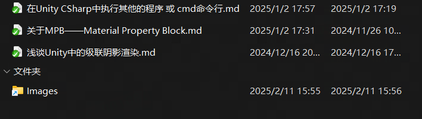

我习惯使用 Typora 编辑 Markdown 文件。

在编写不同的 Markdown 文件时，插入图片的路径规则可能不同，比如编写此笔记项目时，图片文件放置在 md 文件所在目录中的 Images 文件夹中；而编写基于 Hexo 的博客文章时，图片则需要放置在 md 文件的父级目录下的 images 文件夹中。

Typora 目前没有什么好的方式可以实现自动化切换图片相对路径，但是我找到了一个更有意思的方法，那就是使用 Windows 的符号链接机制。

[mklink 命令文档](https://learn.microsoft.com/en-us/windows-server/administration/windows-commands/mklink)

比如说下面这个命令会在 Hexo 的 post 文件夹下创建一个符号链接，有点像一个快捷方式，以一个文件夹的形式存在。当 Typora 试图按照笔记的规则，向 md 文件所在目录的 Images 文件夹中插入图片时，它能找到这个符号链接，并向其中插入图片文件，然而，图片在硬盘上的位置其实是被链接到的父目录中的 images 文件夹。

```bash
cd /d "你的Hexo项目根目录\source\_posts"
mklink /D Images ..\images
```

 

如此一来，就能在不改动 Typora 插入图片路径设置的情况下将图片放到正确的位置了；并且，经过验证，使用符号链接后生成的 Hexo 页面可以正确找到图像。

但是出现了一个新的问题，当使用符号链接插入图片时，在 MD 中的图像引用路径也会使用这个符号链接，而非图像的真实相对位置。Typora 可以通过符号链接访问到对应的图片，但是有时环境会脱离 Typora，比如在 Github 中直接访问 MD 文件时。Github 项目并不支持符号链接，我做了一个小项目验证这一点：[Link](https://github.com/Romantoscalion/windows_github_mklink_md_test)

因此，在使用了符号链接的场合，最好还是将图片的链接恢复到不依赖符号链接的形式，这里分享一个作者自用的简单 jupyter 去做到这件事：[Link](https://github.com/Romantoscalion/Romantoscalion.github.io/blob/main/source/_posts/fix_images_path_tool.ipynb)

